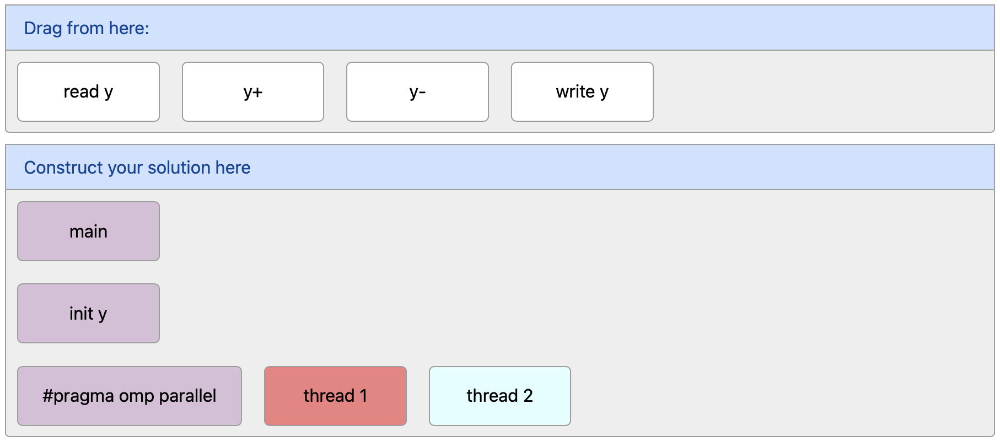

# PrairieLearn OER Element: Drag and Drop Grid

This element was developed by Kiriratanak Vong, Runjeet Narula, and Anika Sikka from UC Berkeley. The project was advised by Narges Norouzi, Dan Garcia, and Armando Fox. Please carefully test the element and understand its features and limitations before deploying it in a course. It is provided as-is and not officially maintained by PrairieLearn, so we can only provide limited support for any issues you encounter!

If you like this element, you can use it in your own PrairieLearn course by copying the contents of the `elements` folder into your own course repository. After syncing, the element can be used as illustrated by the example question that is also contained in this repository.

📌 [View our Poster](poster.pdf)

## `pl-grid` element

This element creates a 2-dimensional grid on which students can drag and drop blocks. The number of grid columns is set to a fixed width of 12, with blocks taking up 2 columns by default. The number of rows is flexible and will expact as more blocks are added. 

The element is defined in 3 parts:

1. The `pl-source` grid contains a supply of all the blocks that can be used to create the solution. If a block is dragged from this grid, it is replaced with a new block. Placed blocks can also be deleted by dragging them back into this grid.

2. The `pl-destination` grid defines all pre-defined blocks that are shown when the element is loaded. These blocks are not movable by students.

3. The `pl-answer-grid` grid defines the correct solution for the question. This grid must also contain the pre-defined blocks in the same location as they are initially placed for the question to be solvable.

The grid supports auto-grading based on the number of blocks that match the correct solution. Pre-defined blocks are excluded from this calculation. More fine-grained partial scoring (e.g., for blocks that exist, but are misplaced) is not supported by default and has to be manually set up in a `server.py` grading function.

### Example



```html
<pl-grid color-column="true">
    <pl-source> <!-- Source grid with supply of draggable blocks -->
        <pl-element x="0" y="0">read y</pl-element>
        <pl-element x="2" y="0" color="#ffffff">y+</pl-element>
        <pl-element x="4" y="0" color="#ffffff">y-</pl-element>
        <pl-element x="6" y="0" color="#ffffff">write y</pl-element>
    </pl-source>

    <pl-destination> <!-- Pre-defined destination grid -->
        <pl-element x="0" y="0" color="#d8bfd8">main</pl-element>
        <pl-element x="0" y="1" color="#d8bfd8">init y</pl-element>
        <pl-element x="0" y="2" w="3" color="#d8bfd8">#pragma omp parallel</pl-element>
        <pl-element x="3" y="2" color="#f08080">thread 1</pl-element>
        <pl-element x="5" y="2" color="#e0ffff">thread 2</pl-element>
    </pl-destination>
    
    <pl-answer-grid> <!-- Solution grid (used for grading) -->
        <pl-element x="0" y="0">main</pl-element>
        <pl-element x="0" y="1">init y</pl-element>
        <pl-element x="0" y="2" w="3">#pragma omp parallel</pl-element>
        <pl-element x="3" y="2">thread 1</pl-element>
        <pl-element x="5" y="2">thread 2</pl-element>
        <pl-element x="3" y="3">read y</pl-element>
        <pl-element x="3" y="4">y+</pl-element>
        <pl-element x="3" y="5">write y</pl-element>
    </pl-answer-grid>
</pl-grid>
```

### Element (pl-grid) Attributes

| Attribute | Type | Description |
| --- | --- | --- |
| `color-column` | boolean (default: `false`) | If set to `true`, blocks dragged into the grid will be colored the same color as the first non-white block in their column. |


### Block (pl-element) Attributes

| Attribute | Type | Description |
| --- | --- | --- |
| `x` | string (required) | The x-position of the block (0-indexed, i.e., the leftmost column is 0). The width of blocks needs to be taken into account when determining the value, as overlapping blocks are shifted to resolve the overlap. |
| `y` | string (required) | The y-position of the block (0-indexed, i.e., the topmost row is 0). The width of blocks needs to be taken into account when determining the value, as overlapping blocks are shifted to resolve the overlap. |
| `w` | string (default: `"2"`) | The width (in columns) of the block. |
| `h` | string (default: `"1"`) | The height (in rows) of the block |
| `color` | string (default: `"#ffffff"`) | The color of the block. Colors are not considered for grading. |